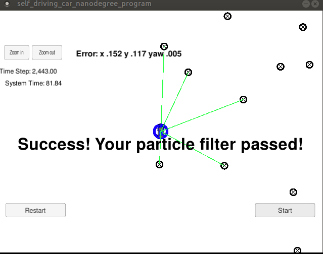

## **Kidnapped Vehicle**

### Overview

---
In this project a [particle filter](https://en.wikipedia.org/wiki/Particle_filter) is implemented (in C++) to localize a moving vehicle with noisy measurements. The vehicle runs in a simulator which can be downloaded [here](https://github.com/udacity/self-driving-car-sim/releases). 
Also, [uWebSocketIO](https://github.com/uWebSockets/uWebSockets) is needed in this project which is responsible for the communication between the unscented Kalman filter and the simulator.

### Dependencies
---
* cmake >= 3.5
* make >= 4.1 (Linux, Mac)
* gcc/g++ >= 5.4
 

### Building the code 
---
Once the install for uWebSocketIO is complete, the main program can be built and run by doing the following from the project top directory.

1. mkdir build
2. cd build
3. cmake ..
4. make

Alternatively some scripts have been included to streamline this process, these can be leveraged by executing the following in the top directory of the project:

1. ./clean.sh
2. ./build.sh
3. ./run.sh

Note: This would generate an excutable **particle_filter** in the **build** directory.

### Running and testing the particle filter
---

1. Run the simulator
2. Execute ./particle_filter in the build directory; Alternatively, execute ./run.sh

The following figure shows the particle filter has successfully passed the test (in 82 seconds using 10 particles). 

